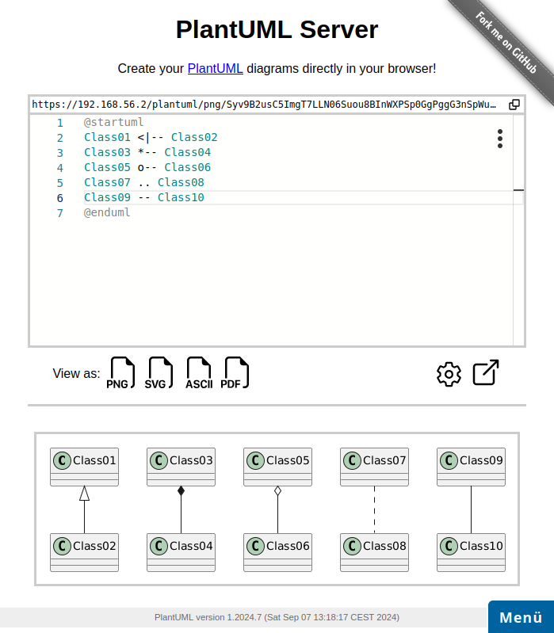
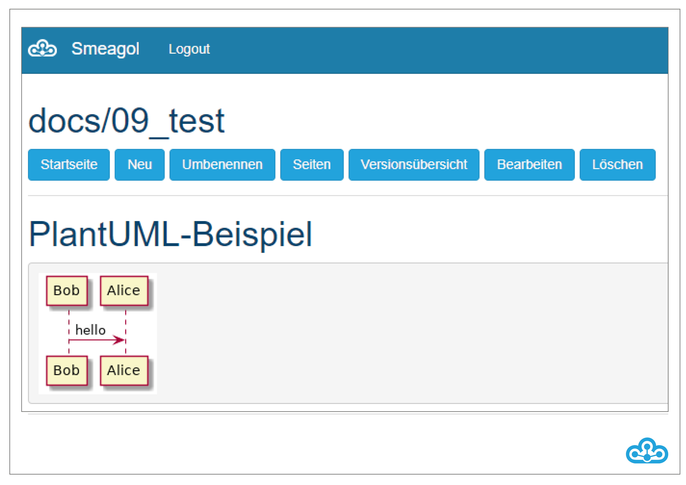

# Plantuml

Mit dem PlantUML-Dogu wird die Integration von UML-Diagrammen in Wikis in textueller Form ermöglicht. Das UML-Diagramm wird dabei als Text beschrieben und wie Quelltext versioniert. Ein Editor für PlantUML ist im EcoSystem über die URL `https://FQDN/plantuml` erreichbar (z.B. `https://ecosystem.beispiel.de/plantuml`).


Mit dem Editor lassen sich Diagramme in einer Weboberfläche direkt im Browser beschreiben. Parallel dazu wird unterhalb des Codes eine Vorschau des generierten UML-Diagramms angezeigt. Die Einbindung des Diagramms in ein Wiki erfolgt durch Angabe der jeweiligen PlantUML-URL, die zwischen Codefenster und Diagrammvorschau angezeigt wird.




Eine weitere Möglichkeit, PlantUML-Diagramme direkt im Smeagol-Wiki einzubinden, ist die textuelle Beschreibung des Diagramms innerhalb der entsprechenden Markdown-Datei. Der eingegebene Sachverhalt wird von Smeagol in Verbindung mit PlantUML interpretiert und anschließend als Diagramm dargestellt.

```
​```uml
Bob -> Alice : hello
​```
```

Die abgebildete Eingabe in einer Markdown-Datei erzeugt dabei das folgende Ergebnis im Wiki:



Eine Dokumentation ist unter [http://plantuml.com/](http://plantuml.com/) verfügbar.

Weitere nützliche Tipps sind im [Public CES](https://cloudogu.windcloud.de/smeagol/FjSp0UMOA1D6/main/docs/Home) zu finden.
