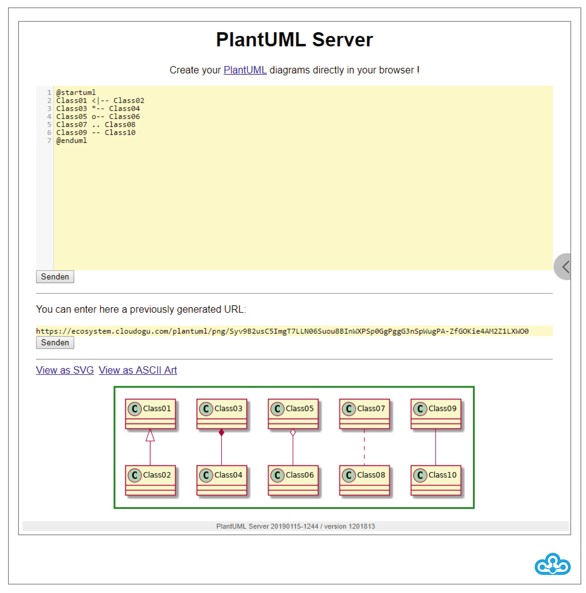

Translated with www.DeepL.com/Translator

# PlantUML
The PlantUML-Dogu enables the integration of UML-diagrams into wikis in textual form. The UML diagram is described as text and versioned like source code. An editor for PlantUML is available in the EcoSystem via the URL `https://FQDN/plantuml` (e.g. https://ecosystem.beispiel.de/plantuml).\newline
\newline

The editor can be used to describe diagrams in a web interface directly in the browser. In parallel, a preview of the generated UML diagram is displayed below the code. The integration of the diagram into a wiki is done by specifying the respective PlantUML URL, which is displayed between the code window and the diagram preview.



\pagebreak

Another way to include PlantUML diagrams directly in the Smeagol wiki is to provide a textual description of the diagram within the corresponding Markdown file. The entered facts are interpreted by Smeagol in conjunction with PlantUML and then displayed as a diagram.

```
``uml
Bob -> Alice : hello
```
```

The shown input in a Markdown file produces the following result in the wiki:


Documentation is available at [http://plantuml.com/](http://plantuml.com/).
